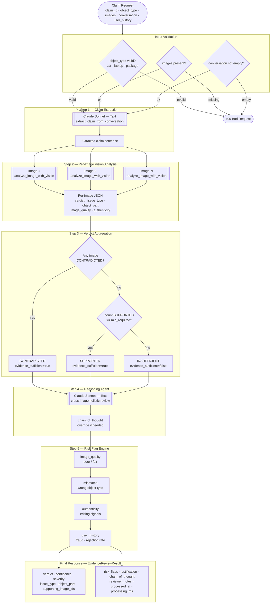

# ClaimLens — AI Damage Claim Intelligence

An AI-powered damage claim verification system using Claude Vision to analyze images and determine whether submitted evidence **supports**, **contradicts**, or is **insufficient** to verify a damage claim across cars, laptops, and packages.

---

## Architecture



---

## Verdict Decision Logic

| Condition | Result |
|---|---|
| Any image returns `CONTRADICTED` | **CONTRADICTED** (overrides all support) |
| `count(SUPPORTED) >= minimum_evidence_required` | **SUPPORTED** |
| Otherwise | **INSUFFICIENT** |

> Contradiction takes unconditional priority. This prevents cherry-picked evidence where one clean image is submitted alongside damage photos of a different vehicle.

---

## Pipeline — 5 Steps

| Step | What happens | Claude calls |
|---|---|---|
| **1. Claim extraction** | Conversation → 1-sentence damage claim (cached) | 1 text call |
| **2. Vision analysis** | All images analyzed in parallel via `asyncio.gather` | N vision calls |
| **3. Aggregation** | Pure Python — contradiction override, min evidence gate | 0 |
| **4. Reasoning Agent** | Holistic cross-image review, can override preliminary verdict | 1 text call |
| **5. Risk flags** | Post-verdict — structurally cannot change the verdict | 0 |

---

## Risk Flag Categories

| Flag type | Severity | Trigger |
|---|---|---|
| `image_quality` | low / high | Image is poor or fair quality |
| `mismatch` | high | Image shows wrong object type |
| `authenticity` | high | Visual signs of editing or staging detected |
| `user_history` | medium / high | Prior fraud flags, elevated risk score, or >50% rejection rate |

> Risk flags run **after** verdict aggregation and **cannot** change the verdict. Informational only.

---

## WhatsApp Intake

ClaimLens supports end-to-end claim filing via WhatsApp — no portal, no app download.

```
Customer texts "hi"
      ↓
Bot asks: car / laptop / package?
      ↓
Bot asks: describe the damage
      ↓
Customer sends 1–5 photos → replies DONE
      ↓
AI pipeline runs in background (~30s)
      ↓
Bot replies with verdict + severity + next steps
```

See [WHATSAPP_SETUP.md](./WHATSAPP_SETUP.md) for Twilio configuration.

---

## Project Structure

```
evidence-review/
├── backend/
│   ├── app.py                  # FastAPI — full AI pipeline
│   ├── whatsapp.py             # Twilio WhatsApp intake
│   ├── server.py               # Production entry (uvloop + httptools)
│   └── requirements.txt
├── frontend/
│   ├── src/
│   │   ├── App.jsx
│   │   ├── components/
│   │   │   ├── Header.jsx
│   │   │   ├── ClaimForm.jsx
│   │   │   ├── ConversationBuilder.jsx
│   │   │   ├── ImageUploader.jsx
│   │   │   ├── MermaidDiagram.jsx
│   │   │   └── ResultPanel.jsx
│   │   ├── pages/
│   │   │   ├── ReviewPage.jsx
│   │   │   └── ArchitecturePage.jsx
│   │   └── utils/
│   │       ├── api.js
│   │       └── helpers.js
│   ├── package.json
│   └── vite.config.js
├── WHATSAPP_SETUP.md
├── docker-compose.yml
└── README.md
```

---

## Setup

### Backend

```bash
pip install -r backend/requirements.txt
export ANTHROPIC_API_KEY=your_key_here
uvicorn backend.app:app --host 0.0.0.0 --port 8000
```

### Frontend

```bash
cd frontend
npm install
npm run dev        # http://localhost:3000
```

### Docker

```bash
docker-compose up
# Open http://localhost:8000
```

---

## API

### POST /api/review

```json
{
  "claim_id": "CLM-2024-001",
  "object_type": "car",
  "conversation": [
    { "role": "user", "text": "My rear bumper is dented after a parking lot collision." },
    { "role": "agent", "text": "Please upload photos of the damage." }
  ],
  "images": [
    { "image_id": "IMG-001", "base64_data": "<base64>", "media_type": "image/jpeg" }
  ],
  "user_history": {
    "previous_claims": 2, "approved_claims": 2, "rejected_claims": 0,
    "fraud_flags": 0, "account_age_days": 730, "risk_score": 0.15
  },
  "minimum_evidence_required": 1
}
```

### Response

```json
{
  "claim_id": "CLM-2024-001",
  "verdict": "SUPPORTED",
  "verdict_confidence": "high",
  "severity": "moderate",
  "issue_type": "dent",
  "object_part": "rear bumper",
  "supporting_image_ids": ["IMG-001"],
  "risk_flags": [],
  "justification": "IMG-001 shows a clear dent on the rear bumper with paint transfer.",
  "chain_of_thought": "Single image clearly shows rear bumper dent matching the described collision.",
  "overrode_preliminary": false,
  "evidence_sufficient": true,
  "processed_at": "2024-01-15T10:31:04Z",
  "processing_ms": 2847
}
```

### POST /api/batch-review

Array of claim requests. Returns `{ results, errors, total }`.

### POST /whatsapp/webhook

Twilio webhook for WhatsApp intake. See [WHATSAPP_SETUP.md](./WHATSAPP_SETUP.md).

---

## Supported Object Types

| Type | Example issues |
|---|---|
| `car` | dent, scratch, crack, glass_shatter, broken_part |
| `laptop` | crack, broken_part, water_damage, missing_part |
| `package` | crushed_packaging, torn_packaging, water_damage, stain |

---

## Design Decisions

1. **Images are the source of truth.** User history produces flags only — never changes the verdict.
2. **Contradiction overrides everything.** One contradicting image beats any number of supporting images.
3. **Deterministic step before agent.** Pure Python aggregation provides a safe fallback if the agent fails.
4. **Risk flags are post-verdict.** Structurally impossible for flags to influence the verdict.
5. **Prompt injection defense.** Text instructions in images are flagged and ignored; visual evidence decides.
6. **Multilingual by default.** Claim conversations and image text in any language are handled natively.